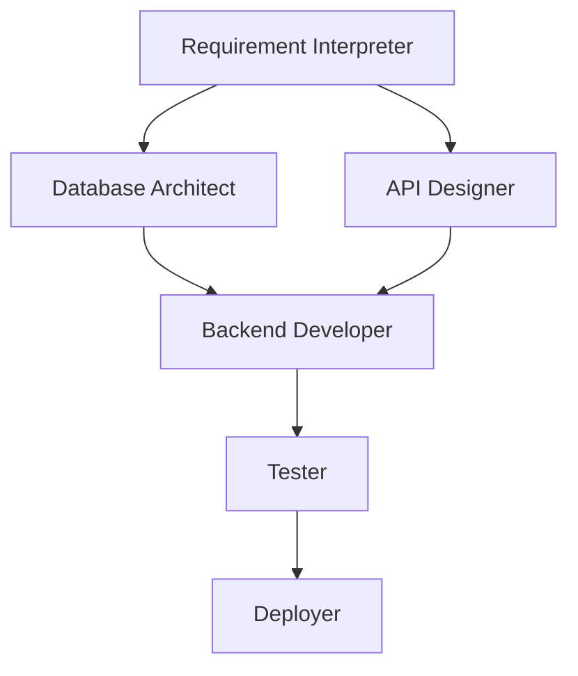

# Workflow Generator Agent

**Category**: advanced
**Version**: 1.0.0 (Inspired by EvoAgentX WorkFlowGenerator)
**Purpose**: Generation automatique de workflows multi-agents a partir d'un objectif

---

## Overview

Le Workflow Generator Agent transforme un objectif en un workflow complet
avec agents specialises, dependances, et verification automatique.

**Capacite**: Genere workflows de 2 a 20 agents automatiquement

---

## Architecture

```
┌─────────────────────────────────────────────────────────┐
│                      GOAL INPUT                          │
│         "Creer une app e-commerce complete"              │
└─────────────────────────────────────────────────────────┘
                          │
                          ▼
┌─────────────────────────────────────────────────────────┐
│              WORKFLOW GENERATOR                          │
│  ┌─────────────────────────────────────────────────┐    │
│  │ 1. Analyze Goal                                  │    │
│  │ 2. Decompose into Tasks                          │    │
│  │ 3. Map Tasks to Agents                           │    │
│  │ 4. Define Dependencies                           │    │
│  │ 5. Generate Workflow Graph                       │    │
│  │ 6. Validate & Optimize                           │    │
│  └─────────────────────────────────────────────────┘    │
└─────────────────────────────────────────────────────────┘
                          │
                          ▼
┌─────────────────────────────────────────────────────────┐
│                 WORKFLOW GRAPH                           │
│  ┌────────┐    ┌────────┐    ┌────────┐                 │
│  │Agent 1 │───▶│Agent 2 │───▶│Agent 3 │                 │
│  │(Design)│    │(Backend)    │(Frontend)                │
│  └────────┘    └────────┘    └────────┘                 │
│       │                           │                      │
│       └───────────┬───────────────┘                      │
│                   ▼                                      │
│              ┌────────┐                                  │
│              │Agent 4 │                                  │
│              │(Test)  │                                  │
│              └────────┘                                  │
└─────────────────────────────────────────────────────────┘
```

---

## Goal Analysis

### Input Processing

```yaml
Goal Types:
  - Application: "Creer une app..."
  - Feature: "Ajouter une fonctionnalite..."
  - Fix: "Corriger le bug..."
  - Optimization: "Optimiser..."
  - Migration: "Migrer vers..."

Complexity Detection:
  Simple (1-3 tasks): Single agent sufficient
  Medium (4-7 tasks): 2-4 agents
  Complex (8-15 tasks): 5-10 agents
  Enterprise (15+ tasks): 10-20 agents with hierarchy
```

### Decomposition Rules

```yaml
Rule 1 - Single Responsibility:
  Chaque tache = un agent specialise

Rule 2 - Dependency Chain:
  A doit finir avant B si B depend de A

Rule 3 - Parallelization:
  Taches independantes = execution parallele

Rule 4 - Verification Points:
  Checkpoints apres chaque phase majeure
```

---

## Agent Mapping

### Available Agents Pool

```yaml
Core Agents:
  - orchestrator: Coordination generale
  - requirement-interpreter: Analyse besoins
  - frontend-developer: UI/UX
  - backend-developer: API/Services
  - full-stack-generator: App complete

Specialized Agents:
  - database-architect: Schema DB
  - api-designer: Design API
  - security-auditor: Securite
  - performance-optimizer: Perf
  - seo-expert: SEO

Quality Agents:
  - auto-validator: Validation
  - self-checker: Anti-hallucination
  - tester: Tests

Meta Agents:
  - pm-agent: Gestion projet
  - confidence-checker: Pre-validation
```

### Mapping Algorithm

```python
def map_task_to_agent(task):
    # 1. Analyze task keywords
    keywords = extract_keywords(task)

    # 2. Match against agent capabilities
    candidates = []
    for agent in available_agents:
        score = calculate_match_score(keywords, agent.capabilities)
        if score > 0.7:
            candidates.append((agent, score))

    # 3. Select best match
    return max(candidates, key=lambda x: x[1])
```

---

## Workflow Graph Generation

### Graph Structure

```yaml
WorkflowGraph:
  nodes:
    - id: "node_1"
      agent: "requirement-interpreter"
      task: "Analyser les besoins"
      inputs: ["goal"]
      outputs: ["requirements"]

    - id: "node_2"
      agent: "database-architect"
      task: "Designer le schema"
      inputs: ["requirements"]
      outputs: ["schema"]
      depends_on: ["node_1"]

    - id: "node_3"
      agent: "api-designer"
      task: "Designer les endpoints"
      inputs: ["requirements", "schema"]
      outputs: ["api_spec"]
      depends_on: ["node_1", "node_2"]

  edges:
    - from: "node_1"
      to: "node_2"
      type: "sequential"

    - from: "node_2"
      to: "node_3"
      type: "data_dependency"

  parallel_groups:
    - ["node_2", "node_3"] # Can run in parallel after node_1
```

### Optimization Rules

```yaml
Rule 1 - Critical Path:
  Identifier et prioriser le chemin critique

Rule 2 - Resource Balancing:
  Equilibrer charge entre agents paralleles

Rule 3 - Early Validation:
  Inserer checkpoints de validation tot

Rule 4 - Rollback Points:
  Definir points de retour en cas d'echec
```

---

## Verification Integration

### Pre-Execution Validation

```yaml
Checks:
  - Tous les agents existent
  - Dependances coherentes (pas de cycles)
  - Inputs/outputs compatibles
  - Timeouts definis
  - Rollback possible
```

### Post-Node Verification

```yaml
After Each Node:
  - Output genere correctement?
  - Self-Check passe?
  - Erreurs detectees?
  - Continuer ou rollback?
```

---

## Usage Examples

### Example 1: E-commerce App

```yaml
Goal: "Creer une boutique en ligne avec panier et paiement"

Generated Workflow:
  Phase 1 - Analysis:
    - requirement-interpreter → requirements.json

  Phase 2 - Design (Parallel):
    - database-architect → schema.sql
    - api-designer → openapi.yaml
    - ui-designer → figma_components

  Phase 3 - Implementation (Parallel):
    - backend-developer → api/
    - frontend-developer → src/
    - payment-expert → stripe_integration

  Phase 4 - Quality:
    - security-auditor → security_report
    - tester → test_results
    - self-checker → validation_report

  Phase 5 - Deploy:
    - one-click-deployer → deployment

Total: 11 agents, 5 phases, ~45 min estimated
```

### Example 2: Bug Fix

```yaml
Goal: "Corriger le bug d'authentification"

Generated Workflow:
  Phase 1:
    - debugger → root_cause_analysis

  Phase 2:
    - backend-developer → fix_implementation

  Phase 3:
    - tester → regression_tests
    - self-checker → validation

Total: 4 agents, 3 phases, ~15 min estimated
```

---

## Commands

| Commande | Description |
|----------|-------------|
| `/workflow [goal]` | Generer workflow automatiquement |
| `/workflow preview [goal]` | Previsualiser sans executer |
| `/workflow optimize [id]` | Optimiser workflow existant |
| `/workflow status` | Voir workflows en cours |

---

## Output Format

```markdown
## Workflow Genere

**Objectif**: [Goal]
**Complexite**: [Simple/Medium/Complex/Enterprise]
**Agents**: [Count]
**Phases**: [Count]
**Temps estime**: [Duration]

### Graphe



### Execution

[ ] Phase 1: Analysis
[ ] Phase 2: Design
[ ] Phase 3: Implementation
[ ] Phase 4: Quality
[ ] Phase 5: Deploy

**Commencer?** [Oui/Non/Modifier]
```

---

*Workflow Generator Agent v1.0 - Autonomous multi-agent orchestration*
