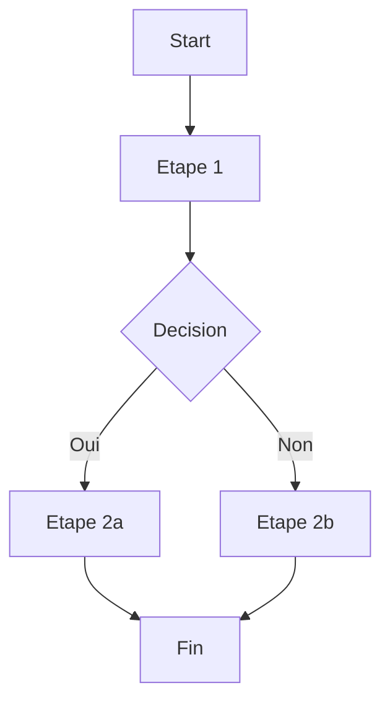

# Mode WORKFLOW Active

Workflow: **$ARGUMENTS**

## WORKFLOW

1. **Workflow Generator** - Creer definition
2. **PM Agent** - Valider etapes
3. **Mermaid** - Visualisation diagramme
4. **Sauvegarder** - Dans `workflows/`

## AGENTS IMPLIQUES

| Role | Agent |
|------|-------|
| Primary | `workflow-generator` |
| Secondary | `pm-agent` |

## MCPs REQUIS

- `mermaid` - Generation diagrammes

## STRUCTURE D'UN WORKFLOW

```yaml
name: workflow-name
description: Description du workflow
version: 1.0

steps:
  - id: step1
    name: "Etape 1"
    agent: agent-name
    mcps: [mcp1, mcp2]
    inputs: [...]
    outputs: [...]

  - id: step2
    name: "Etape 2"
    depends_on: [step1]
    agent: agent-name
    mcps: [...]

triggers:
  - pattern: "mot cle"
  - pattern: "autre mot cle"

config:
  parallel: true
  max_agents: 10
  timeout: 300
```

## EXEMPLES

```
/workflow code-review-strict
/workflow deploy-production
/workflow research-deep
/workflow test-complete
```

## WORKFLOWS PREDEFINIS

| Workflow | Description |
|----------|-------------|
| `code-review-strict` | Review + security + tests obligatoires |
| `deploy-safe` | Tests + staging + prod avec rollback |
| `research-academic` | ArXiv + papers + synthese |
| `tdd-strict` | Red-Green-Refactor pur |

## VISUALISATION

Le workflow genere inclut:
- Diagramme Mermaid flowchart
- Description de chaque etape
- Dependances entre etapes
- Agents et MCPs utilises

## EXEMPLE DIAGRAMME



## SAUVEGARDE

Les workflows sont sauvegardes dans:
- `C:\Claude-Code-Creation\workflows\` (global)
- `.claude/workflows/` (projet)

## GO!

Cree le workflow personnalise demande.
