# Mermaid Diagrams Guide

> **Usage** : Generer des diagrammes visuels dans les docs projet pour documenter l'architecture, les flux et les schemas de donnees.
> **Quand** : Phase PLANIFIER (avant implementation) et VERIFIER (documentation finale).

---

## Types de Diagrammes

| Type | Syntaxe | Usage |
|------|---------|-------|
| Architecture / Flux | `graph TD` ou `graph LR` | Composants, flux de donnees, dependances |
| Sequence | `sequenceDiagram` | Interactions entre services, requetes API |
| Base de donnees | `erDiagram` | Schemas relationnels, entites |
| Machine a etats | `stateDiagram-v2` | Cycle de vie, workflows |
| Timeline | `timeline` | Chronologie de projet, phases |
| Gantt | `gantt` | Planification de taches |

---

## Template 1 : Architecture Composants

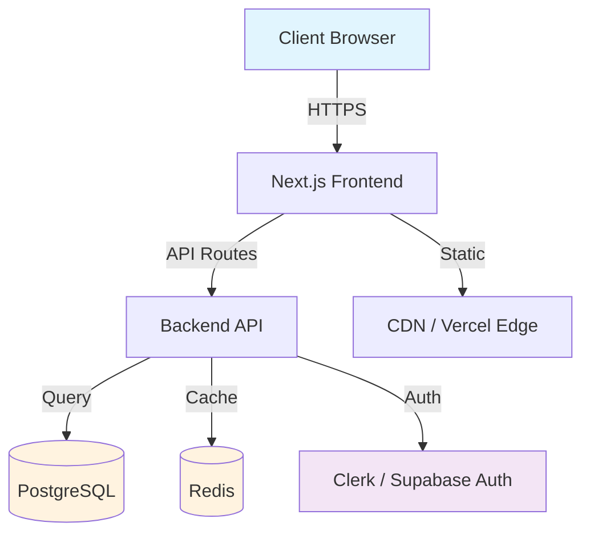

### Variantes courantes

**Microservices :**
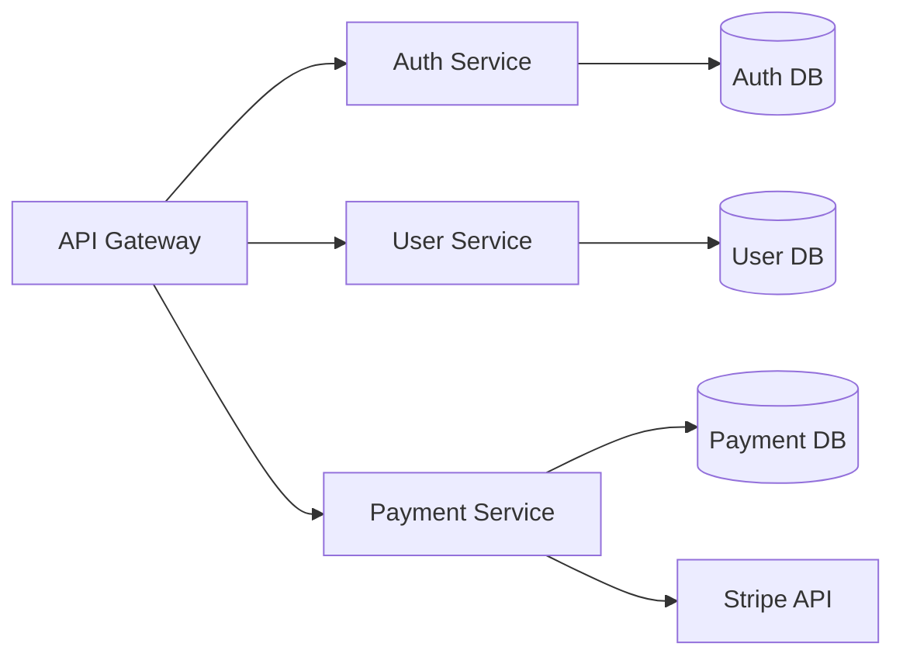

**Monorepo :**
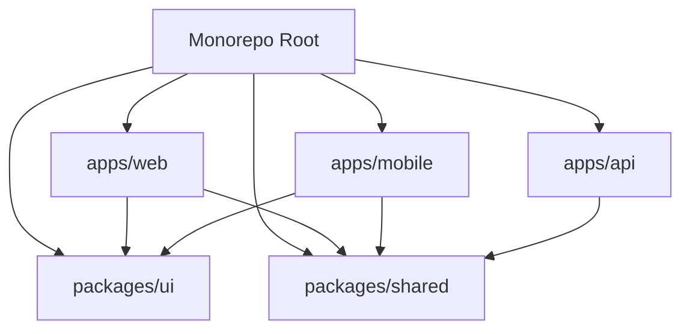

---

## Template 2 : Diagramme de Sequence

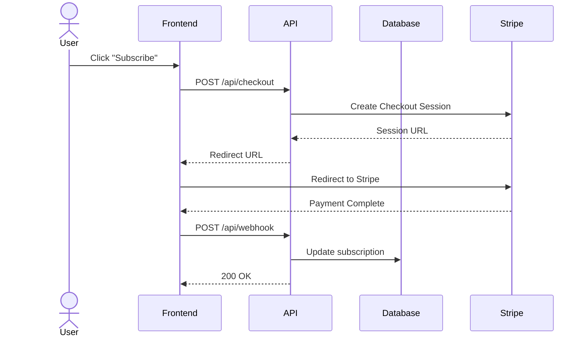

### Variantes

**Auth Flow :**
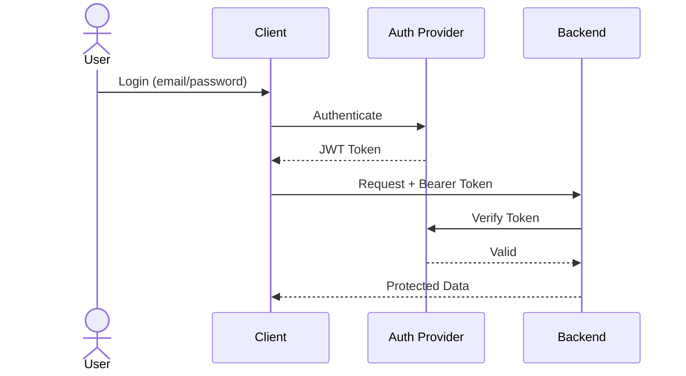

**WebSocket :**
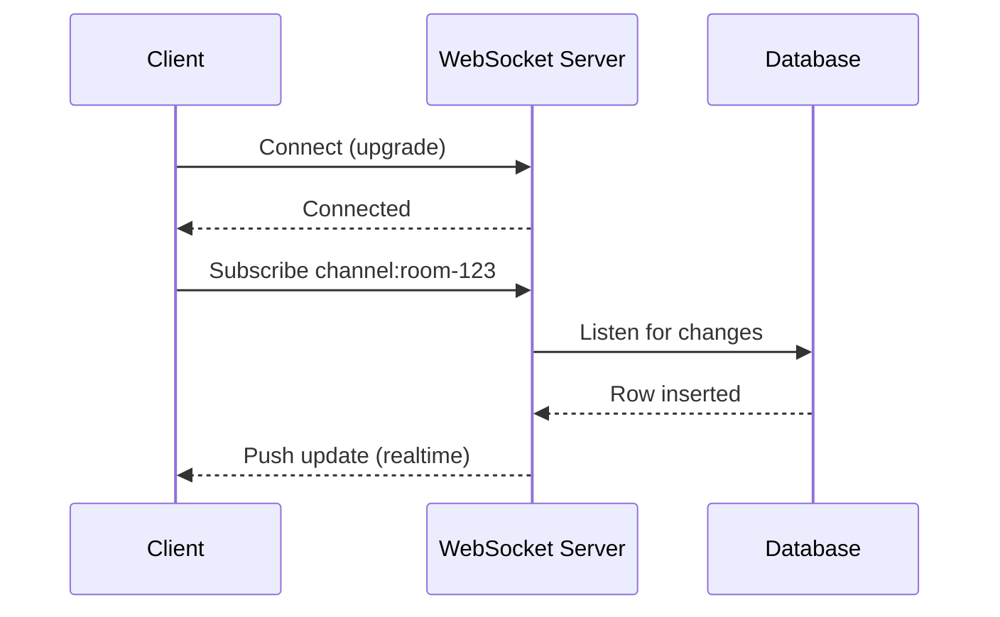

---

## Template 3 : Schema de Base de Donnees (ER)

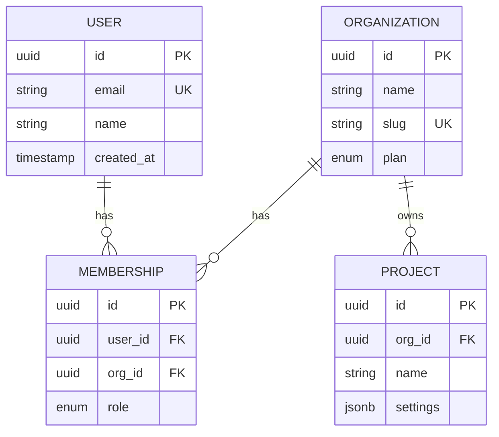

### Variantes

**E-commerce :**
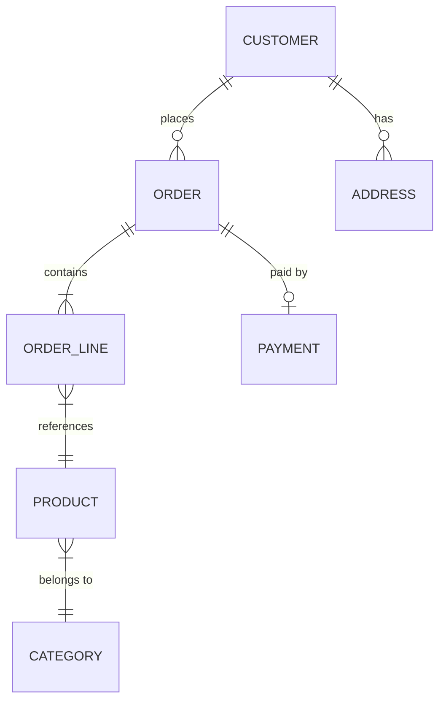

**SaaS Multi-tenant :**
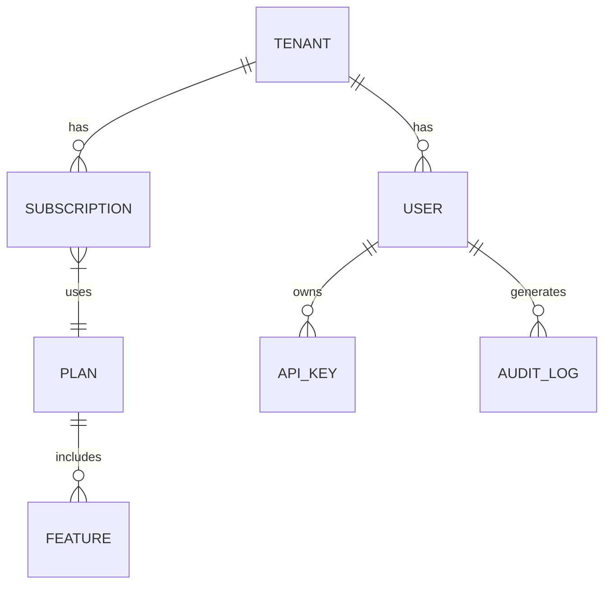

---

## Template 4 : Machine a Etats

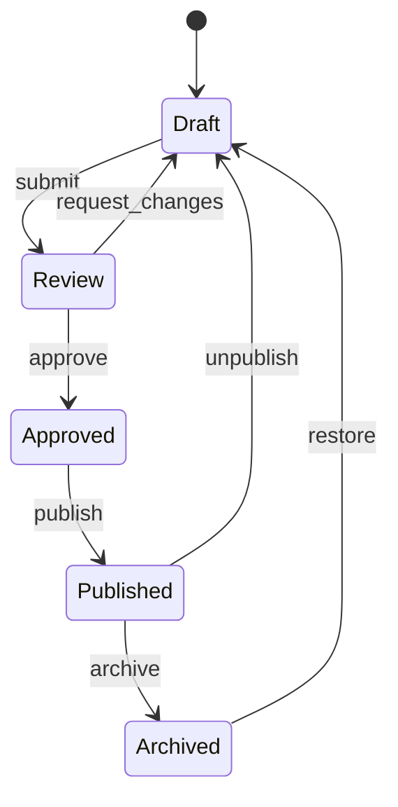

### Variantes

**Order Lifecycle :**
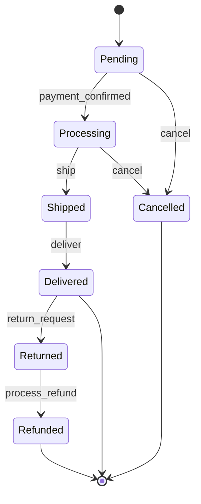

**CI/CD Pipeline :**
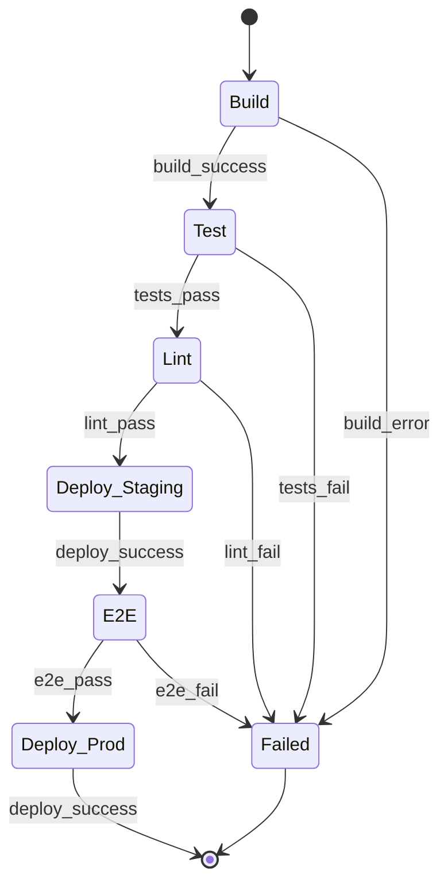

---

## Template 5 : Flux ATUM CREA (Wave Pattern)

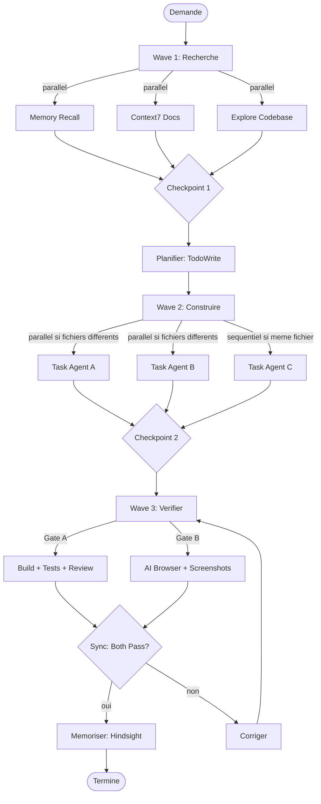

---

## Bonnes Pratiques

### Style et Lisibilite
- Limiter a **15-20 noeuds** par diagramme (au-dela, decouper)
- Utiliser des **couleurs** pour distinguer les couches (`style` ou `classDef`)
- Nommer les **fleches** pour clarifier les transitions
- Preferer `graph TD` (top-down) pour les architectures, `graph LR` (left-right) pour les pipelines

### Couleurs par Convention
```
Frontend  : #e1f5fe (bleu clair)
Backend   : #e8f5e9 (vert clair)
Database  : #fff3e0 (orange clair)
External  : #f3e5f5 (violet clair)
Error     : #ffebee (rouge clair)
```

### Ou Placer les Diagrammes
- `docs/architecture.md` : architecture globale du projet
- `README.md` : diagramme simplifie pour onboarding
- `docs/api-flow.md` : sequences d'interaction API
- `docs/database.md` : schema ER complet

### Integration dans le Cycle ATUM CREA
1. **PLANIFIER** : Generer `graph TD` de l'architecture cible avant de coder
2. **CONSTRUIRE** : Mettre a jour les sequences si le flux change
3. **VERIFIER** : Valider que le diagramme correspond a l'implementation
4. **MEMORISER** : Stocker le pattern dans Hindsight si reutilisable

---

*Mermaid Diagrams Guide - ATUM CREA Knowledge Library*
